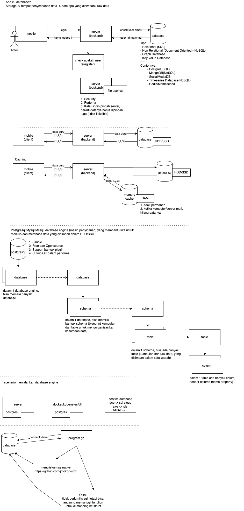

# FGA Kominfo Learning

## Day7 - SQL
- Database (Postgresql)
    - apa itu database
    - kenapa database ada
    - hierarki dalam database
        - database
        - schema
        - table
        - column
    - connect dengan database client (dbeaver)
        - https://dbeaver.io/download/
        - SQL
            - apa itu SQL?
        - membuat table
        - CRUD 
        
    - Deep Dive (little):
        - transaction

- Implementasi GO
    - menjelaskan native dan ORM package
    - query dan mapping ke struct di Go (Native dan ORM)

- Clean Architecture
    - Apa itu clean architecture
    - Kenapa harus ada clean architecture

---
